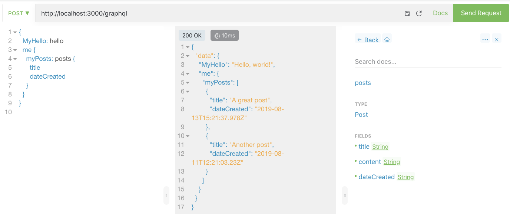

# GraphQL MockFiles Server

A GraphQL mockserver based on files and a typeDefinition

- [GraphQL MockFiles Server](#graphql-mockfiles-server)
  - [Getting started](#getting-started)
    - [Prepare your mockfiles](#prepare-your-mockfiles)
    - [Setup the express server](#setup-the-express-server)
- [How does it work](#how-does-it-work)
- [Further work and new features](#further-work-and-new-features)
- [Changelog](#changelog)
  - [0.0.2](#002)
  - [0.0.1](#001)

## Getting started

This is a mockserver that can be used as
[expressjs middleware](https://expressjs.com/en/guide/using-middleware.html). It
serves mocks based on
[GraphQL type definitions](./graphql-mocks/graphql-mock-schema.graphql) and a
query posted to the server. It can handle
[aliases](https://graphql.org/learn/queries/#aliases).

> Be aware that this mock-middleware currently does not support
> [mutations](https://graphql.org/learn/queries/#mutations). It could be added
> in the future

### Prepare your mockfiles

To make sure the mockserver can provide you with content to your queries,
prepare your directory that contains the responses. The names of each response
needs to be `ok.json`.

Let's take this GraphQL type definition as an example.

```graphql
type Query {
  posts: [Post]
}
type Post {
  title: String
  content: String
  date: Date
  author: Author
}
type Author {
  name: String
}
```

So this typedef would result in the following directory structure.

> take notion of the `author` in the second item in the array. The
> mockfiles-middleware will add `author`-prop `"name": "Albert"` to the first
> item, and leave `author`-prop `"name": "John Doe"` in place

```
mocks/posts/ok.json
[
  {
    "title": "A great post",
    "content": "Lorem ipsum dolor sit amet, [...]",
    "dateCreated": "2019-08-13T15:21:37.978Z"
  },
  {
    "title": "Another post",
    "content": "Suspendisse lectus ligula, pharetra [...]",
    "dateCreated": "2019-08-11T12:21:03.23Z",
    "author": {
      "name": "John Doe"
    }
  }
]
```

```
mocks/posts/author/ok.json
{
  "name": "Albert"
}
```

### Setup the express server

Now setup the express server to serve the mockfiles. Take your typeDefs and the
path and pass it to the mock-middleware:

```js
const bodyParser = require('body-parser');
const path = require('path');
const app = require('express')();

const {
  createGraphQlMockfilesMiddleware,
} = require('graphql-mockfiles-express-middleware');

function main() {
  const graphqlTypeDefs = `
    type Query {
      hello: String
      me: Me
    }

    type Me {
      posts: [Post]
    }

    type Post {
      title: String
      content: String
      dateCreated: String
    }`;

  app.use(bodyParser.json());
  app.use(
    '/graphql',
    // =====================> Mock Middleware
    createGraphQlMockfilesMiddleware(
      graphqlTypeDefs,
      path.resolve(__dirname, './graphql-mocks')
    )
    // =====================> End Mock Middleware
  );
  app.listen(3000, () =>
    console.log('graphQlMockServer launched at localhost:3000')
  );
}
main();
```

Now, when executing a query you'd get the results from the mockserver from the
files:

```graphql
{
  posts {
    title
    author {
      name
    }
  }
}
```

Gives:

```json
{
  "data": {
    "posts": [
      { "title": "A great post", "author": { "name": "Albert" } },
      { "title": "Another post", "author": { "name": "Albert" } }
    ]
  }
}
```

Now execute a query by posting to the server using your
[favorite GraphQL client](https://altair.sirmuel.design/)



# How does it work

The middleware requires you to give `typeDefs` and the `path` to the mock
directory. Then each request it basically generates a new middleware based on
the response of the paths of your separate queries. Each query creates a set of
paths. E.g. the query above creates the following paths (using
`graphql-query-path`)

```json
[
  '/posts/'
  '/posts/title'
  '/posts/author/'
  '/posts/author/name'
]
```

Technically _each of these paths_ can be represented by an `ok.json` in the
directory structure. Earlier paths are overriding later paths. So if
`/posts/ok.json` already returns a complete object representing what's needed in
the query, it'll not get overriden from _sub-paths_.

This allows for powerful features like setting `author`'s specifically in a
`Post` in `/posts/ok.json` or generally in `/posts/author/ok.json`. Have a look
at the differences in the
[posts-mocks in ./graphql-mocks/me/posts/ok.json](./graphql-mocks/me/posts/ok.json)
and the
[author-mocks in ./graphql-mocks/me/posts/author/ok.json](./graphql-mocks/me/posts/author/ok.json)

# Further work and new features

- [] make the mockfiles-middleware work for Mutations

# Changelog

## 0.0.2

- Fixed an issue where values that should be in arrays weren't put in array's

## 0.0.1

- Initial version
